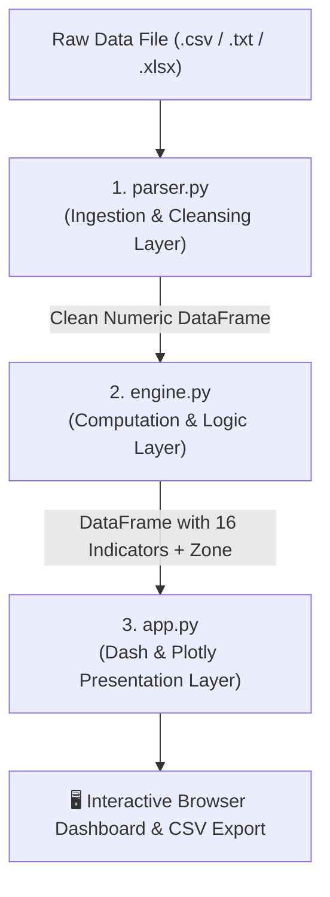

# 🧭 Mudlogging Dashboard — Complete Code & Concept Guide

Welcome! This guide explains **everything** inside this project step-by-step. Even if you have zero background in petroleum engineering or web development, this document will walk you through the real-world concepts, the math, and every file and code section.

---

## 📖 Table of Contents
1. [The Big Picture: What is Mudlogging?](#1-the-big-picture-what-is-mudlogging)
2. [System Architecture: How the 3 Files Work Together](#2-system-architecture-how-the-3-files-work-together)
3. [File 1: `parser.py` (The Data Cleaner)](#3-file-1-parserpy-the-data-cleaner)
4. [File 2: `engine.py` (The Petrophysical Brain)](#4-file-2-enginepy-the-petrophysical-brain)
5. [File 3: `app.py` (The Interactive Web Dashboard)](#5-file-3-apppy-the-interactive-web-dashboard)
6. [Quick Reference Cheat Sheet](#6-quick-reference-cheat-sheet)

---

## 1. The Big Picture: What is Mudlogging?

When an oil and gas company drills thousands of meters into the Earth, a fluid called **drilling mud** is pumped down the drill pipe to cool the drill bit and carry rock fragments back to the surface.

As the drill cuts through rock formations, trapped hydrocarbon gases dissolve into the mud. At the surface, a mudlogging unit uses a **gas chromatograph** to measure the concentrations (in ppm or percentage) of 5 primary hydrocarbon gas types:

| Symbol | Gas Name | Carbon Count | Physical Characteristic |
| :--- | :--- | :--- | :--- |
| **C1** | Methane | 1 Carbon ($CH_4$) | Lightest gas, dominant in natural gas reservoirs |
| **C2** | Ethane | 2 Carbons ($C_2H_6$) | Light gas |
| **C3** | Propane | 3 Carbons ($C_3H_8$) | Medium-weight gas |
| **iC4 & nC4** | Iso-butane & Normal-butane | 4 Carbons ($C_4H_{10}$) | Heavier gas, suggests liquid oil |
| **iC5 & nC5** | Iso-pentane & Normal-pentane | 5 Carbons ($C_5H_{12}$) | Heavy gas, strongly associated with crude oil |
| **TG** | Total Gas | Sum of all gases | Total hydrocarbon volume |

### 🎯 The Goal of this Software
By analyzing the **ratios and proportions** of these gases across measured depths, this software automatically:
1. Cleans messy field data.
2. Calculates **16 petrophysical indicators** (Pixler & Haworth ratios, Dryness, Carbon Index, etc.).
3. Uses a physics-based expert rule engine to classify every depth interval into:
   - 🟢 **Gas** (Natural Gas payzone)
   - 🔴 **Oil** (Crude Oil payzone)
   - 🔵 **Water** (Water-bearing or wet zone)
   - ⚪ **No Show** (Non-productive rock / background noise)
4. Renders a full-screen **continuous 24-track well-log** dashboard directly in your web browser.

---

## 2. System Architecture: How the 3 Files Work Together

The codebase is organized into 3 cleanly separated layers:



---

## 3. File 1: `parser.py` (The Data Cleaner)

Raw files from drilling rigs are notorious for being messy: they have operator comments on top, inconsistent column headers, blank rows, and missing readings. `parser.py` solves this.

### Key Function: `parse_mudlog_file(file_path_or_buffer)`

#### Step A: Format Identification & Header Isolation (Lines 18–37)
```python
# Slices lines until it finds DEPTH, METRES, or C1
header_idx = 0
for i, line in enumerate(lines[:100]):
    line_upper = line.upper()
    if 'DEPTH' in line_upper or 'METRES' in line_upper or 'C1' in line_upper:
        header_idx = i
        break

content = "".join(lines[header_idx:])
df_raw = pd.read_csv(io.StringIO(content))
```
* **What it does:** Scans the first 100 lines of the file for keywords like `DEPTH` or `C1`. It discards any rig comments or metadata above that line and begins reading tabular columns from the actual table header.

#### Step B: Column Normalization & Aliasing (Lines 41–56)
```python
column_mapping = {
    'DEP': 'DEPTH', 'DEPTH_M': 'DEPTH', 'DEPTH_METRES': 'DEPTH',
    'CH4': 'C1', 'METHANE': 'C1',
    'C2H6': 'C2', 'ETHANE': 'C2',
    'C3H8': 'C3', 'PROPANE': 'C3',
    'I-C4': 'IC4', 'ISOBUTANE': 'IC4', 'I_C4': 'IC4',
    'N-C4': 'NC4', 'NORMALBUTANE': 'NC4', 'N_C4': 'NC4',
    'I-C5': 'IC5', 'ISOPENTANE': 'IC5', 'I_C5': 'IC5',
    'N-C5': 'NC5', 'NORMALPENTANE': 'NC5', 'N_C5': 'NC5',
    'TOTAL_GAS': 'TG', 'GAS': 'TG', 'TOT_GAS': 'TG'
}
df_raw = df_raw.rename(columns=column_mapping)
```
* **What it does:** Different logging companies use different column names (one writes `CH4`, another writes `METHANE` or `C1`). This dictionary translates all possible variations into standard tokens (`DEPTH`, `C1` to `NC5`, `TG`).

#### Step C: Type Casting & Data Cleansing (Lines 57–80)
```python
# 1. Fill missing columns with 0.0
for col in ['DEPTH', 'C1', 'C2', 'C3', 'IC4', 'NC4', 'IC5', 'NC5']:
    if col not in df_raw.columns:
        df_raw[col] = 0.0

# 2. Drop rows where DEPTH is not a valid number
# 3. Convert all text values into floating point numbers (float64)
for col in cols_to_convert:
    df_clean[col] = pd.to_numeric(df_clean[col], errors='coerce').fillna(0.0)

# 4. Sort by depth from shallowest to deepest
df_clean = df_clean.sort_values(by='DEPTH').reset_index(drop=True)
```
* **What it does:** Ensures that all numbers are real floats, invalid characters become `0.0`, corrupted rows are eliminated, and rows are ordered strictly by depth.

---

## 4. File 2: `engine.py` (The Petrophysical Brain)

`engine.py` contains the mathematical petrophysical formulas and the decision logic.

### 1. Safe Division (`_safe_div`)
In computing, dividing by zero causes crashes (`ZeroDivisionError`). In drilling data, a gas like `C2` or `C3` can be `0.0`. `_safe_div` safely returns `NaN` (Not a Number) instead of throwing an error.

### 2. Core Computation: `compute_all(df)`
Given a clean dataframe with depth and gas channels, this function calculates the 16 petrophysical indicators:

#### A. Pixler Hydrocarbon Ratios (Lines 49–56)
* **$R_1 = \frac{C_1}{C_2}$**: Delineates gas vs oil regime. High ratio ($>15$) indicates light methane-rich gas. Low ratio ($<2$) indicates water or non-commercial gas.
* **$R_2 = \frac{C_1}{C_3}$**: Secondary gas/oil discriminator.
* **$R_3 = \frac{C_2}{C_3}$**: Liquid hydrocarbon indicator.
* **$R_4 = \frac{C_1}{iC_4}$** & **$R_5 = \frac{C_1}{nC_4}$**: Compares methane against butane isomers (sensitive to heavier oil fractions).

#### B. Total Gas & Gas Dryness (Lines 60–75)
* **$\text{Derived TG} = C_1 + C_2 + C_3 + iC_4 + nC_4 + iC_5 + nC_5$**: Sums all measured hydrocarbons.
* **$\text{Dryness} = \frac{C_1}{\text{Derived TG}}$**: What fraction of the total gas is pure methane?
  * $\ge 0.85$ (85%+) $\rightarrow$ Dry Gas
  * $0.50 - 0.85$ $\rightarrow$ Wet Gas / Light Oil
  * $< 0.50$ $\rightarrow$ Heavy Oil / Condensate

#### C. Carbon Index ($C_i$) (Lines 80–82)
$$\text{Carbon Index} = \frac{\text{TG}}{C_1 + 2C_2 + 3C_3 + 4iC_4 + 4nC_4 + 5iC_5 + 5nC_5}$$
* Multiplies each gas by its number of carbon atoms. Shows whether the gas mixture is carbon-dense (oil) or light (gas).

#### D. Haworth Ratios (Lines 85–101)
The industry gold-standard interpretation method:
* **Wetness ($W_h\%$)** $= \frac{C_2 + C_3 + iC_4 + nC_4 + iC_5 + nC_5}{\text{TG}} \times 100$
  * Percentage of gas that consists of heavier molecules ($C_2+$).
* **Balance ($B_h$)** $= \frac{C_1 + C_2}{C_3 + iC_4 + nC_4 + iC_5 + nC_5}$
  * Compares light ends ($C_1, C_2$) against heavy ends ($C_3+$).
* **Character ($C_h$)** $= \frac{iC_4 + nC_4 + iC_5 + nC_5}{C_3}$
  * Indicates how heavy the oil is.

#### E. Wetness-Balance Score ($WBS$) (Lines 114–127)
A combined logarithmic separation metric between $W_h$ and $B_h$. When $WBS > 0$, it signifies strong gas pay potential.

---

### 3. The Expert Classification System: `_classify_zones(df)` (Lines 147–293)
Rather than a "black-box" machine learning algorithm that is hard to explain to regulators, this engine uses a **physics-based majority voting matrix**:

1. **Step 1: Noise Filtering**
   * If $\text{Total Gas} < 300\text{ ppm}$ or $C_1 < 200\text{ ppm}$, it is immediately classified as **"No Show"** (natural background noise).
2. **Step 2: 8 Independent Indicator Votes**
   * Each depth interval collects votes for **Gas**, **Oil**, and **Water** from 8 separate indicators (Haworth $W_h, B_h, C_h$, Dryness, Pixler $R_1$, $WBS$, $GOR$, and $GOW$).
3. **Step 3: Majority Decision**
   * Whichever category earns the most votes is assigned as the definitive fluid state for that depth.

---

## 5. File 3: `app.py` (The Interactive Web Dashboard)

`app.py` builds and serves the desktop web application using **Dash** (a Python framework by Plotly).

### Section Breakdown of `app.py`:

```
app.py Structure:
├── 1. Imports & Color Palette (Lines 20–60)
├── 2. Continuous Track Specifications (Lines 63–89)
├── 3. Synthetic Mock Data Generator (Lines 96–134)
├── 4. App Initialization & Glassmorphic CSS (Lines 139–207)
├── 5. UI Layout Components: Modal, Navbar, Main Body (Lines 213–337)
├── 6. Plotly Multi-Track Chart Callback (Lines 378–483)
├── 7. File Upload & CSV Export Callbacks (Lines 488–570)
└── 8. Browser Auto-Launch Entry Point (Lines 574–584)
```

#### Detailed Look at Key Sections:

1. **Continuous Track Specifications (`CONTINUOUS_TRACK_SPECS`)**:
   Defines the 24 columns rendered in the well log, including their curve color and whether they use a logarithmic (`log`) or linear (`linear`) scale.
   
2. **Mock Data Generator (`generate_initial_mudlog_data`)**:
   Generates a realistic 85-station synthetic well log (1800m to 3100m) complete with payzones at 2100m–2450m so the app displays working charts immediately upon launch.

3. **Plotly Multi-Track Chart Builder (`render_full_continuous_tracks`)**:
   - Uses `make_subplots(rows=1, cols=total_cols, shared_yaxes=True)`.
   - Inverts the Y-axis (`autorange="reversed"`) so depth starts at $0\text{m}$ at the top and increases downwards (just like real wellbore logs).
   - Generates shaded curve fills (`fill="tozerox"`) with translucent RGB tints.
   - Adds the **Fluid Zone** bar chart on the far right column (colored 🟢 Green for Gas, 🔴 Red for Oil, 🔵 Blue for Water, ⚪ Slate for No Show).
   - Dynamically proportions track widths to guarantee **100% screen fit with zero horizontal scrolling**.

4. **Reactive Callbacks**:
   - `toggle_upload_modal`: Opens and closes the file upload window.
   - `handle_mudlog_upload`: Takes user-dropped files, runs `parser.py` and `engine.py`, and updates the dashboard instantly.
   - `export_csv_report`: Converts computed data into a downloadable CSV report.
   - `open_browser`: Spawns a background thread that automatically opens `http://127.0.0.1:8051` in your default browser.

---

## 6. Quick Reference Cheat Sheet

| File | Primary Job | Key Function / Output |
| :--- | :--- | :--- |
| [`parser.py`](file:///c:/Users/moham/Documents/Skripsi/Mudlogging/parser.py) | Reads `.csv`, `.txt`, `.xlsx`, cleans headers, fixes bad numbers | `parse_mudlog_file()` $\rightarrow$ Clean DataFrame |
| [`engine.py`](file:///c:/Users/moham/Documents/Skripsi/Mudlogging/engine.py) | Calculates 16 petrophysical parameters & assigns fluid zones | `compute_all()` $\rightarrow$ 16 columns + `ZONE` |
| [`app.py`](file:///c:/Users/moham/Documents/Skripsi/Mudlogging/app.py) | UI dashboard, Plotly multi-track renderer, file upload & CSV download | `app.run(port=8051)` $\rightarrow$ Browser UI |

### How to Run:
In your terminal, simply execute:
```bash
py app.py
```
Your browser will open automatically displaying the complete continuous mudlog!
